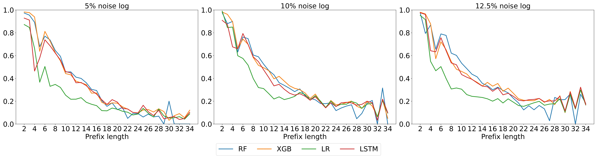
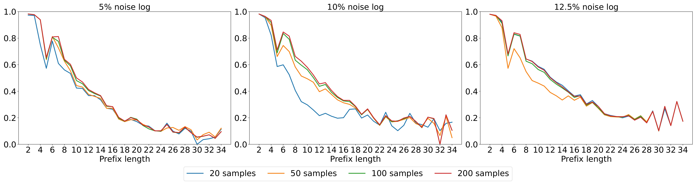
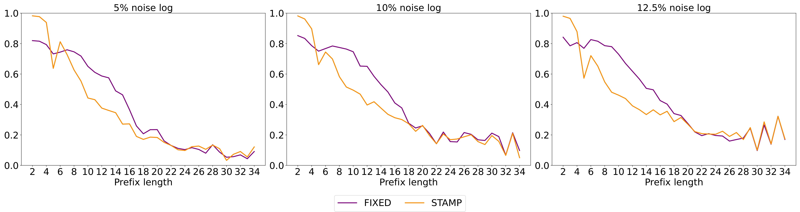

# Online Semi-supervised Anomaly Detection

## Abstract
---
Business processes can deviate from expected behavior, leading to anomalies that affect compliance and reliability. Most existing methods detect anomalies offline and ignore limited labels from experts. We present __STAMP__: _Semi-supervised sTreaming AnoMaly detection using next activity Prediction._ STAMP combines next-activity prediction with anomaly classification, continuously updated in a streaming setting. Evaluations on benchmark logs show that STAMP detects anomalies early with high recall while requiring only a small number of expert labels, making streaming anomaly detection more practical for real-world use.


## Repository Structure
```
data/                     # Benchmark datasets with injected noise
   ├── 0.049_noise.csv
   ├── 0.099_noise.csv
   └── 0.125_noise.csv
experiment/               # Main experiment notebooks
   ├── online_anomaly_detection_celoss.ipynb
   ├── online_anomaly_detection_classifier.ipynb
   ├── online_anomaly_detection_fixed.ipynb
   ├── online_anomaly_detection_lstm.ipynb
   ├── result_analysis.ipynb
   └── result_analysis2.ipynb
img/                      # Figures
   └── STAMP example.jpg
src/ (root-level scripts) # Supporting Python modules
   ├── analyze_wrong_pred.py
   ├── encoding.py
   ├── sliding_window.py
   └── utils.py
```
## Method
---
<p align="center">
    
</p>


## Results
- Benchmark logs with 3 noise levels (0.049, 0.099, 0.125).
- STAMP achieves high recall in early anomaly detection with only a modest number of labeled anomalies.

<p align="center">
    Anomaly F1-scores across prefix lengths by numbers of revealed labels (XGB Classifier)
    
</p>


<p align="center">
    Anomaly F1-scores across prefix lengths by classifiers
    
</p>


<p align="center">
    Performance comparison: Baseline & STAMP Approach
    
</p>
